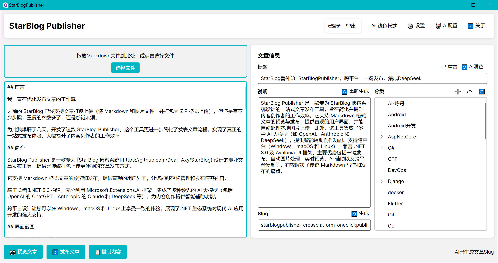
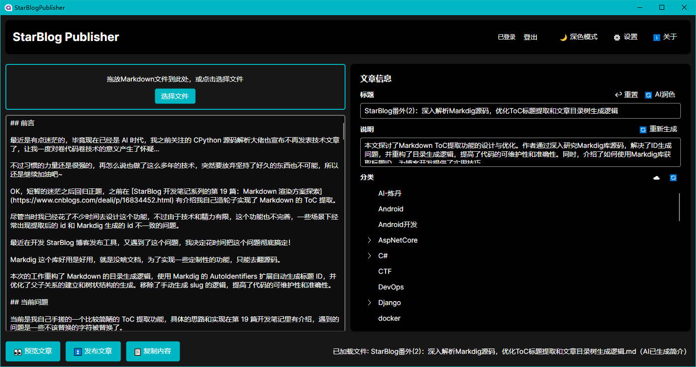
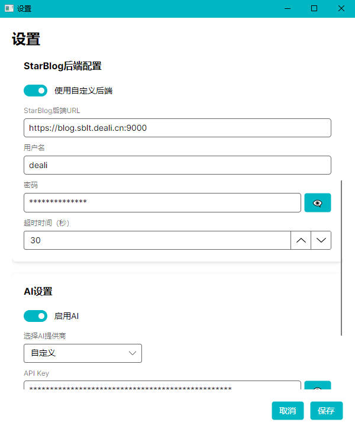
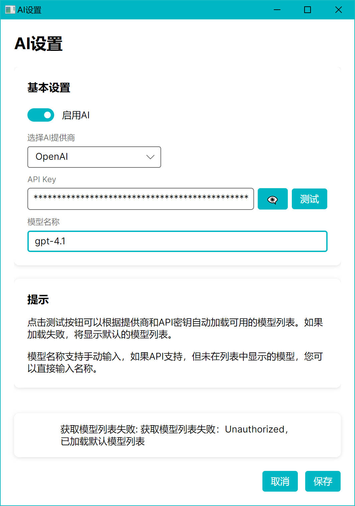
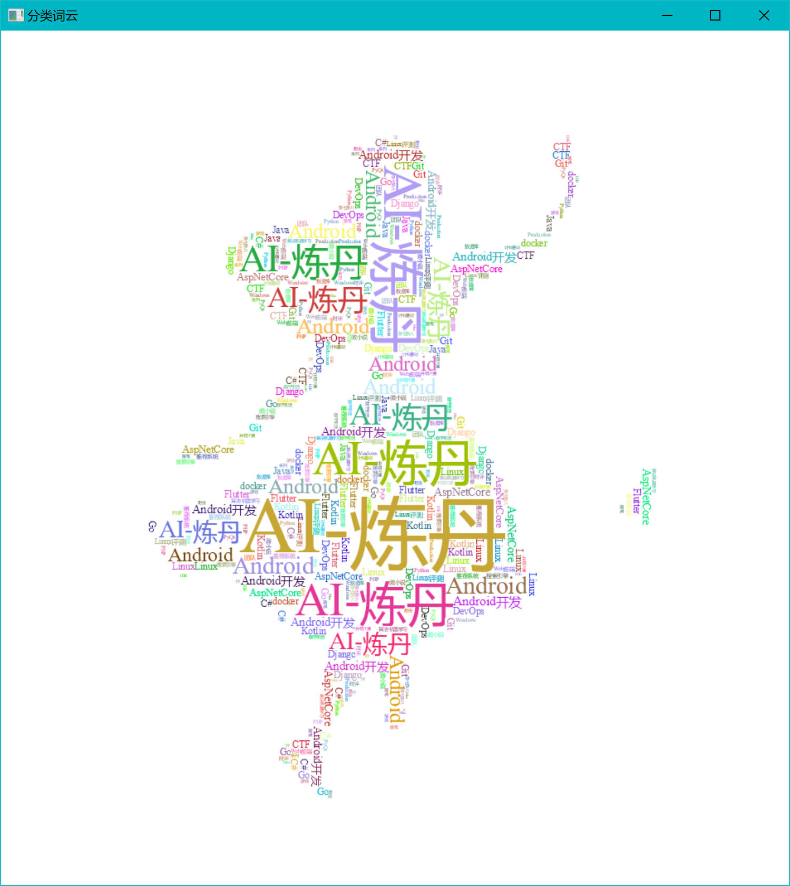
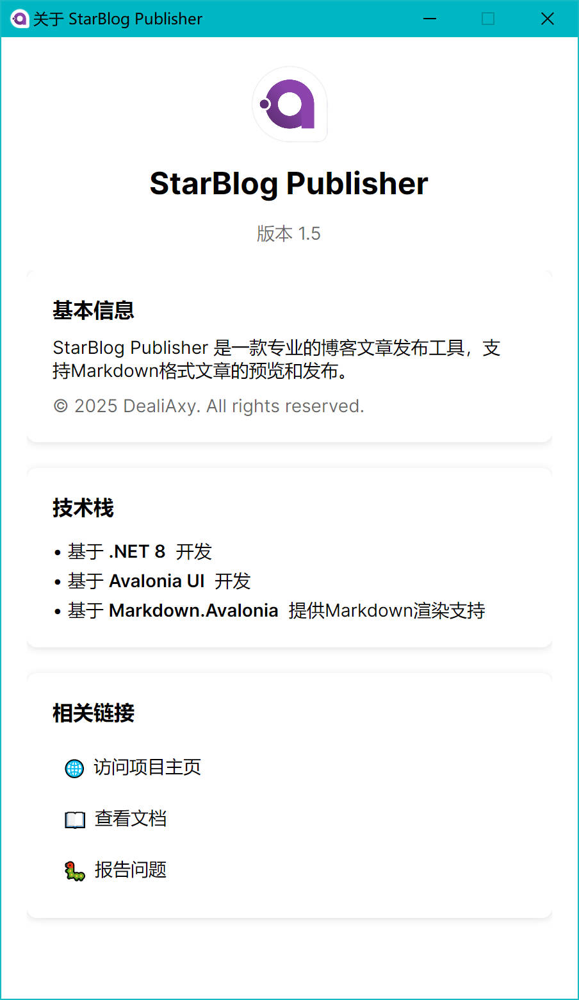

# StarBlog Publisher


StarBlog Publisher 是一款专为 [StarBlog博客系统](https://github.com/Deali-Axy/StarBlog) 设计的专业文章发布工具。支持三种使用方式：**桌面 GUI**、**命令行 CLI** 和 **MCP Server**（供 AI Agent 调用）。

核心亮点：

* **三端共享架构**：GUI / CLI / MCP 共享同一套业务逻辑（Core 类库），行为一致
* **Markdown 文章即写即发**：编辑、预览和发布一气呵成
* **CLI 命令行工具**：支持脚本化、自动化的博客发布流程
* **MCP Server**：让 Claude、Cursor、Copilot 等 AI Agent 直接操作你的博客
* **AI 智能创作助手**：内置 OpenAI、Claude、Gemini、DeepSeek 等主流大模型
* **全平台兼容**：基于 .NET 10.0，支持 Windows、macOS 和 Linux


## 项目结构

```
StarBlogPublisher.Core/       # 共享核心库（无 UI 依赖）
├── Models/                   # 数据模型
├── Services/                 # 基础设施服务（API、AI、配置等）
├── Services/Application/     # 应用服务（业务编排层）
└── Utils/                    # PromptBuilder、PromptTemplates 等

StarBlogPublisher/            # GUI 项目（Avalonia 桌面应用）
├── ViewModels/               # ViewModel 层（调用 Application 服务）
├── Views/                    # 视图层 (.axaml)
└── Models/                   # GUI 专属模型（如 AvaloniaImageInfo）

StarBlogPublisher.Cli/        # CLI + MCP Server
├── Program.cs                # 入口路由（CLI 模式 / MCP 模式）
├── McpServer.cs              # MCP Server（stdio 传输）
├── Commands/                 # CLI 命令
└── Tools/                    # MCP Tools

StarBlogPublisher.Tests/      # 单元测试（xunit + Moq）
```

## 界面预览

### 主界面

| 主界面（浅色模式）                                  | 主界面（深色模式）                                  |
| --------------------------------------------------- | --------------------------------------------------- |
|  |  |

### 设置界面

| 主设置                                | AI设置                              |
| ------------------------------------- | ----------------------------------- |
|  |  |

### 其他功能

| 分类词云                              | 关于                              |
| ------------------------------------- | --------------------------------- |
|  |  |

## 安装与使用

### 系统要求

- .NET 10.0 运行时
- Windows 10+ / macOS / Linux

### 安装方式

**Scoop（Windows）：**

```powershell
scoop bucket add starblog-publisher https://github.com/star-blog/starblog-publisher.git
scoop install starblog-publisher/starblog-publisher
```

**手动安装：**

从 [Releases](https://github.com/star-blog/starblog-publisher/releases) 页面下载最新版本，解压后运行。

### GUI 使用

```bash
dotnet run --project StarBlogPublisher
```

首次运行点击设置按钮配置博客后端 API 地址，如需 AI 功能请配置 AI 提供商和 API 密钥。

### CLI 使用

```bash
# 认证
dotnet run --project StarBlogPublisher.Cli -- auth login --username admin --password 123456
dotnet run --project StarBlogPublisher.Cli -- auth status
dotnet run --project StarBlogPublisher.Cli -- auth logout

# 分类管理
dotnet run --project StarBlogPublisher.Cli -- category list
dotnet run --project StarBlogPublisher.Cli -- category create --name "技术笔记"

# 文章发布
dotnet run --project StarBlogPublisher.Cli -- post publish ./hello.md --category 1
dotnet run --project StarBlogPublisher.Cli -- post publish ./hello.md --category 1 --draft
dotnet run --project StarBlogPublisher.Cli -- post publish ./hello.md --category 1 --auto       # AI 自动生成标题/摘要/Slug，交互确认后发布
dotnet run --project StarBlogPublisher.Cli -- post publish ./hello.md --category 1 --auto -y    # 自动挡 + 跳过确认直接发布
dotnet run --project StarBlogPublisher.Cli -- post get <article-id>

# AI 辅助
dotnet run --project StarBlogPublisher.Cli -- ai generate-summary ./hello.md
dotnet run --project StarBlogPublisher.Cli -- ai optimize-title "原始标题"
dotnet run --project StarBlogPublisher.Cli -- ai suggest-tags ./hello.md
dotnet run --project StarBlogPublisher.Cli -- ai generate-slug "文章标题"
```

### MCP Server

MCP Server 模式让 AI Agent（Claude Desktop、Cursor 等）可以直接操作你的博客。

**启动 MCP Server：**

```bash
dotnet run --project StarBlogPublisher.Cli -- mcp
```

**在 Claude Desktop / Cursor 中配置：**

```json
{
  "mcpServers": {
    "starblog": {
      "command": "dotnet",
      "args": ["run", "--project", "/path/to/StarBlogPublisher.Cli", "--", "mcp"]
    }
  }
}
```

**可用的 MCP Tools：**

| Tool | 描述 |
|------|------|
| `auth_login` | 登录到 StarBlog 后端 |
| `auth_status` | 查看登录状态 |
| `auth_logout` | 登出 |
| `category_list` | 列出所有分类 |
| `category_create` | 创建新分类 |
| `post_publish` | 发布 Markdown 文件为文章 |
| `post_get` | 获取文章详情 |
| `ai_optimize_title` | AI 优化标题 |
| `ai_generate_summary` | AI 生成摘要 |
| `ai_suggest_tags` | AI 推荐标签 |
| `ai_generate_slug` | AI 生成 URL slug |
| `ai_generate_cover_prompt` | AI 生成封面图提示词 |

## 功能特点

- **Markdown 支持**：完整支持 Markdown 格式，包括图片、链接、代码块等
- **图片上传**：自动处理 Markdown 中的本地图片，上传至 StarBlog 服务实例
- **文章预览**：实时预览 Markdown 渲染效果
- **文章管理**：支持文章的创建、编辑、发布和删除
- **分类管理**：支持按树状图显示文章分类，并支持添加分类
- **AI 辅助**：集成多种 AI 模型，提供标题润色、内容总结、关键词提取、Slug 自动生成
- **AI 自动挡发布**：`--auto` 模式一键生成标题/摘要/Slug，交互确认后发布，支持 `-y` 跳过确认
- **词云生成**：可视化展示博客内容关键词
- **主题切换**：支持亮色/暗色主题切换
- **代理设置**：支持配置 HTTP 代理
- **CLI 自动化**：命令行工具支持脚本化发布流程
- **MCP 集成**：AI Agent 可通过 MCP 协议直接操作博客

## 技术栈

- **框架**：.NET 10.0
- **GUI**：Avalonia 11.3.10 + CommunityToolkit.Mvvm 8.4.0
- **CLI**：System.CommandLine 2.0.8
- **MCP**：ModelContextProtocol 1.3.0
- **HTTP**：Refit 9.0.2
- **AI**：Microsoft.Extensions.AI.OpenAI
- **Markdown**：Markdig 0.44.0
- **图片处理**：SixLabors.ImageSharp 3.1.12
- **JSON**：Newtonsoft.Json 13.0.4
- **加密**：System.Security.Cryptography.ProtectedData 10.0.1
- **测试**：xunit + Moq + FluentAssertions

## 开发指南

### 环境准备

- .NET 10.0 SDK
- Visual Studio 2022 / Rider / VS Code

### 构建

```bash
# 构建整个解决方案
dotnet build StarBlogPublisher.sln

# 运行测试
dotnet test StarBlogPublisher.Tests/StarBlogPublisher.Tests.csproj

# 运行 GUI
dotnet run --project StarBlogPublisher

# 运行 CLI
dotnet run --project StarBlogPublisher.Cli -- --help

# 运行 MCP Server
dotnet run --project StarBlogPublisher.Cli -- mcp
```

## 贡献指南

欢迎贡献代码、报告问题或提出新功能建议！

1. Fork 本仓库
2. 创建特性分支 (`git checkout -b feature/amazing-feature`)
3. 提交更改 (`git commit -m 'Add some amazing feature'`)
4. 推送到分支 (`git push origin feature/amazing-feature`)
5. 打开 Pull Request

## 许可证

本项目采用 MIT 许可证 - 详情请参阅 [LICENSE](LICENSE) 文件

## 联系方式

- 项目作者：[Deali-Axy](https://github.com/Deali-Axy)
- 电子邮件：dealiaxy@gmail.com
- 项目主页：[StarBlog Publisher](https://github.com/star-blog/starblog-publisher)
- 配套博客系统：[StarBlog](https://github.com/Deali-Axy/StarBlog)

## 更新记录

### 2.0

* **重大重构**：提取 Core 共享库，三端（GUI / CLI / MCP）共享同一套业务逻辑
* **新增 CLI 命令行工具**：支持 auth、category、post、ai 等命令，可脚本化发布流程
* **新增 MCP Server**：让 AI Agent（Claude Desktop、Cursor 等）直接操作博客
* **架构优化**：从 ViewModel 中提取 Application 服务层，业务逻辑与 UI 解耦
* **新增单元测试**：71 个测试用例，覆盖核心业务逻辑
* 升级至 .NET 10.0

### 1.5

* 新增 AI 设置窗口，支持 AI 服务的初始化与配置
* 新增文章 Slug 生成功能
* 支持显示和切换多种 AI 服务模型

### 1.4

- 重构词云生成逻辑并添加加载指示器
- 添加 GitHub Actions 发布工作流和构建脚本

### 1.3

- 添加分类功能，可直接在发布工具里快速添加分类

### 1.2

- 更新 Avalonia 到 11.2.6 版本
- 预览窗口引入双栏布局

### 1.1

- 优化对 AOT 的支持

### 1.0

- 第一个发布的版本

---

**StarBlog Publisher** - 为 StarBlog 打造的专业发布工具，让博客发布变得简单高效！
