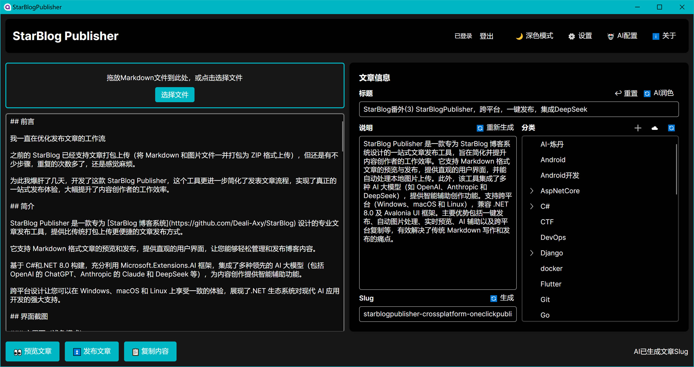
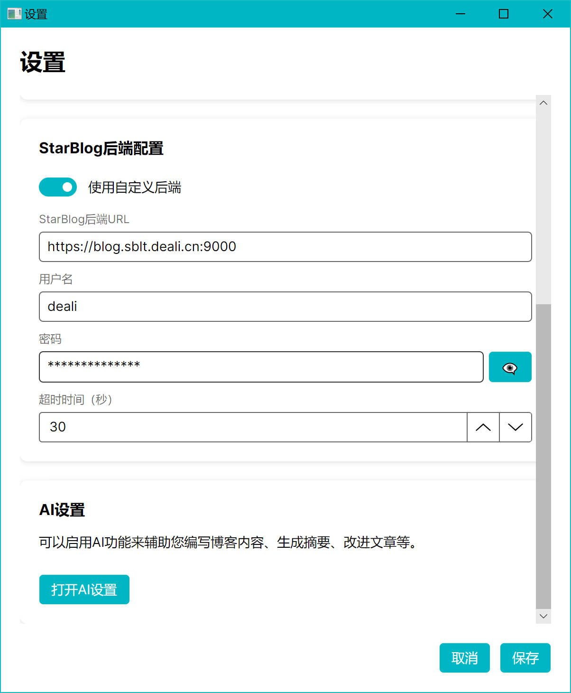
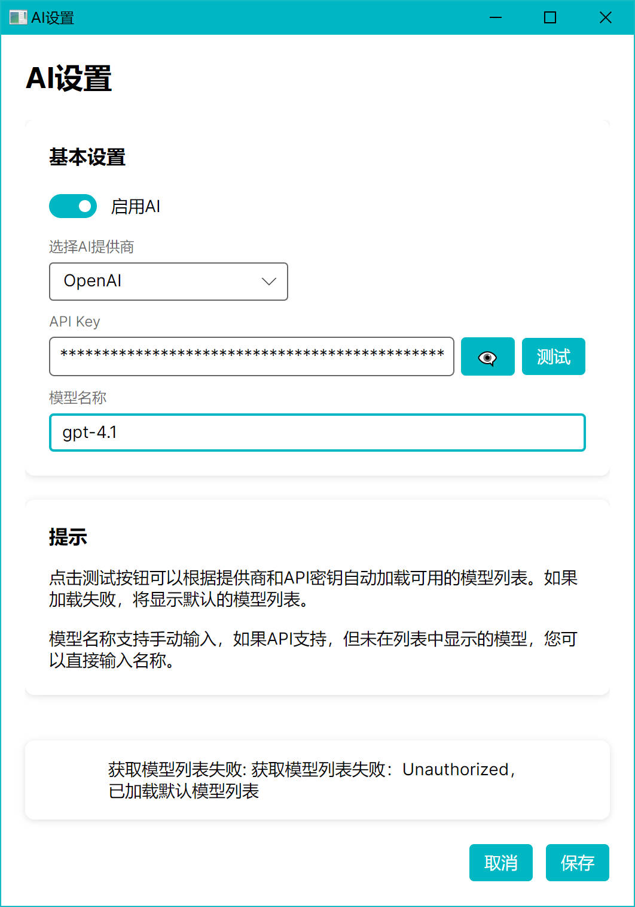
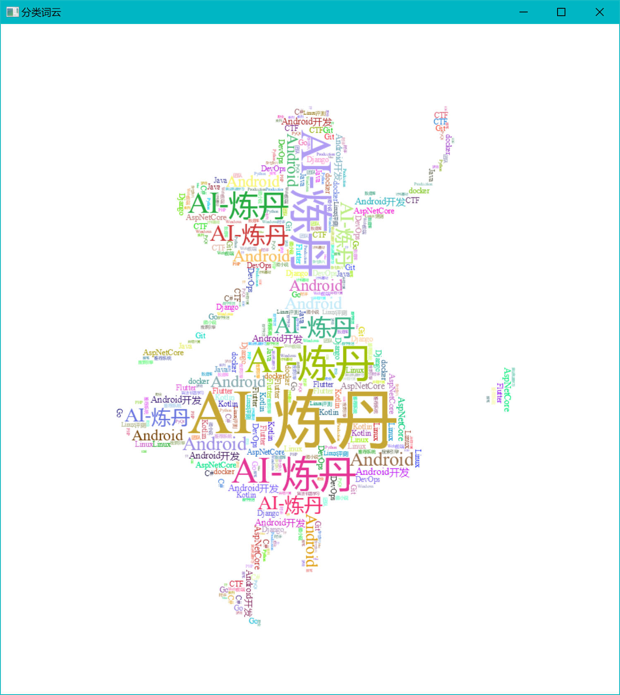
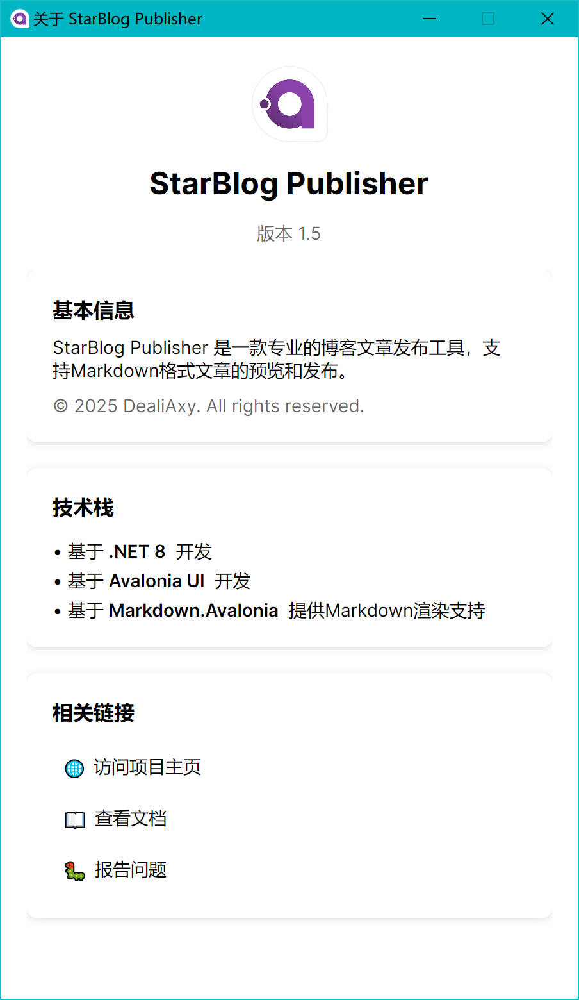

# StarBlog Publisher


StarBlog Publisher 是一款专为 [StarBlog博客系统](https://github.com/Deali-Axy/StarBlog) 设计的专业文章发布工具，它彻底告别传统的打包上传，带来更高效、更友好的文章发布体验。

✨ 核心亮点：

* Markdown 文章即写即发： 编辑、预览和发布一气呵成。
* 直观界面： 简洁易用，内容管理一目了然。
* AI 智能创作助手： 内置 OpenAI ChatGPT、Anthropic Claude、Google Gemini、DeepSeek 等主流大模型，助你灵感不断，写作更高效。
* 全平台兼容： 基于 C# 和 .NET 8.0，支持 Windows、macOS 和 Linux，体验一致。
* 现代 AI 深度集成： 利用 Microsoft.Extensions.AI，驱动新一代内容创作体验。

让内容创作更轻松高效，StarBlog Publisher 是你值得信赖的博客发布助手！


## 界面预览

### 主界面

| 主界面（浅色模式）                                  | 主界面（深色模式）                                  |
| --------------------------------------------------- | --------------------------------------------------- |
|  |  |

### 设置界面

| 主设置                                | AI设置                              |
| ------------------------------------- | ----------------------------------- |
|  |  |

### 其他功能

| 分类词云                              | 关于                              |
| ------------------------------------- | --------------------------------- |
|  |  |

## 解决Markdown写作的痛点

在使用Markdown进行博客写作时，我们经常会遇到以下痛点：

- **图片处理繁琐**：使用Typora等编辑器写作时，本地图片的管理和上传是一个常见的痛点。每次发布文章都需要单独处理图片资源
- **发布流程复杂**：传统的博客发布方式通常需要多个步骤，包括导出文章、处理图片、登录后台、填写信息等
- **多平台适配困难**：将同一篇文章发布到不同平台（如个人博客、知乎、公众号等）时，需要重复进行格式调整
- **版本管理不便**：文章的多次修改和更新难以追踪和管理

## StarBlog Publisher的优势

相比于传统的文章发布方式，StarBlog Publisher提供了以下优势：

- **一键发布**：直接从本地Markdown文件发布到博客系统，无需手动打包上传
- **自动图片处理**：自动识别并处理Markdown中的本地图片，上传至服务器并更新链接
- **实时预览**：所见即所得的编辑体验，确保发布效果符合预期
- **跨平台复制**：发布后可一键复制格式化内容，方便发表到知乎、公众号等其他平台
- **AI辅助创作**：集成多种AI大模型，提供标题润色、内容总结等智能辅助功能
- **本地与云端同步**：保持本地文章与已发布文章的同步，便于持续更新

虽然StarBlog已经支持文章打包上传（将Markdown和图片文件一并打包为ZIP格式上传），但StarBlog Publisher更进一步简化了这一流程，实现了真正的一站式发布体验，大幅提升了内容创作者的工作效率。

## 功能特点

- **Markdown支持**：完整支持Markdown格式，包括图片、链接、代码块等
- **图片上传**：自动处理Markdown中的本地图片，上传至StarBlog服务实例
- **文章预览**：实时预览Markdown渲染效果
- **文章管理**：支持文章的创建、编辑、发布和删除
- **分类管理**：支持按树状图显示StarBlog文章分类，并支持添加分类
- **AI辅助**：集成多种AI模型（OpenAI、Claude、DeepSeek等），提供基于大模型的文章标题润色、文章总结、Slug/简介自动生成功能，大幅提升内容创作效率
- **词云生成**：可视化展示博客内容关键词
- **主题切换**：支持亮色/暗色主题切换
- **代理设置**：支持配置HTTP代理，解决网络访问问题
- **自定义后端**：可配置自定义的StarBlog博客后端API地址

## 技术栈

- **UI框架**：Avalonia 11.2.6
- **开发语言**：C# (.NET 8.0)
- **MVVM框架**：CommunityToolkit.Mvvm 8.2.1 + ReactiveUI 19.5.41
- **Markdown处理**：Markdig 0.40.0 + Markdown.Avalonia 11.0.3-a1
- **HTTP客户端**：Refit 8.0.0 + Refit.Newtonsoft.Json 8.0.0
- **AI集成**：Microsoft.Extensions.AI 9.3.0-preview.1.25161.3
- **对话框**：MessageBox.Avalonia 3.1.5
- **词云生成**：Sdcb.WordCloud 2.0.1
- **加载中指示器**：LoadingIndicators.Avalonia 11.0.11.1
- **JSON处理**：Newtonsoft.Json 13.0.3
- **工具库**：CodeLab.Share 1.4.1
- **安全加密**：System.Security.Cryptography.ProtectedData 9.0.3

## 安装与使用

### 系统要求

- Windows 10 或更高版本
- .NET 8.0 运行时

### 安装步骤

1. 从[Releases](https://github.com/star-blog/starblog-publisher/releases)页面下载最新版本
2. 解压缩下载的文件
3. 运行 `StarBlogPublisher.exe`

### 配置说明

1. 首次运行时，点击设置按钮配置博客后端API地址
2. 如需使用AI功能，请在设置中配置相应的AI提供商和API密钥
3. 如有网络访问问题，可配置HTTP代理

## 开发指南

### 环境准备

- Visual Studio 2022 或更高版本
- .NET 8.0 SDK

### 构建步骤

1. 克隆仓库
   ```
   git clone https://github.com/star-blog/starblog-publisher.git
   ```

2. 使用Visual Studio打开解决方案文件 `StarBlogPublisher.sln`

3. 还原NuGet包

4. 构建并运行项目

## 贡献指南

欢迎贡献代码、报告问题或提出新功能建议！请遵循以下步骤：

1. Fork 本仓库
2. 创建您的特性分支 (`git checkout -b feature/amazing-feature`)
3. 提交您的更改 (`git commit -m 'Add some amazing feature'`)
4. 推送到分支 (`git push origin feature/amazing-feature`)
5. 打开一个 Pull Request

## 许可证

本项目采用 MIT 许可证 - 详情请参阅 [LICENSE](LICENSE) 文件

## 联系方式

- 项目作者：[Deali-Axy](https://github.com/Deali-Axy)
- 电子邮件：dealiaxy@gmail.com
- 项目主页：[StarBlog Publisher](https://github.com/star-blog/starblog-publisher)
- 配套博客系统：[StarBlog](https://github.com/Deali-Axy/StarBlog)

## 更新记录

### 1.5

* 新增 AI 设置窗口 及相关功能，支持 AI 服务的初始化与配置，带来更智能的内容辅助体验。
* AI 设置界面 支持自动完成，下拉建议框在输入框获取焦点时自动弹出，提升交互效率。
* 新增 文章 Slug 生成功能，便于文章 URL 自动化与 SEO 优化。
* 支持显示和切换多种 AI 服务模型，并完善清华智谱模型描述信息。

### 1.4

- 重构词云生成(Sdcb.WordCloud)逻辑并添加加载指示器(LoadingIndicators.Avalonia)
- 添加GitHub Actions发布工作流和构建脚本

### 1.3

- 添加分类功能，现在可以直接在发布工具里快速添加分类了！

### 1.2

- 更新Avalonia相关依赖到11.2.6版本
- 预览窗口引入双栏布局，左侧显示原始Markdown内容，右侧显示HTML预览

### 1.1

- 优化对 AOT 的支持，目前在 AOT 下已经正常可用了

### 1.0

- 第一个发布的版本

---

**StarBlog Publisher** - 为StarBlog打造的专业发布工具，让博客发布变得简单高效！

